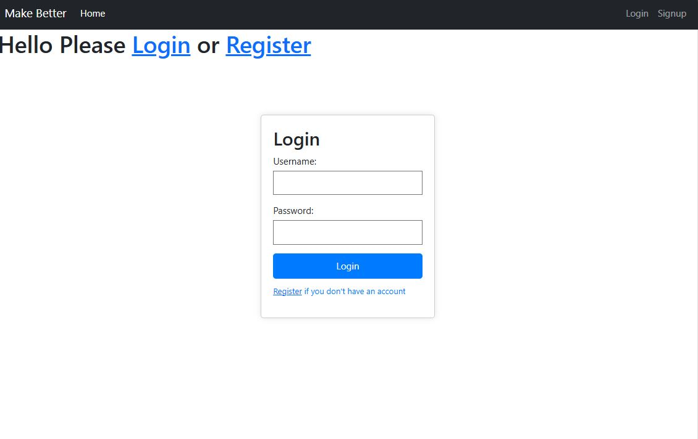
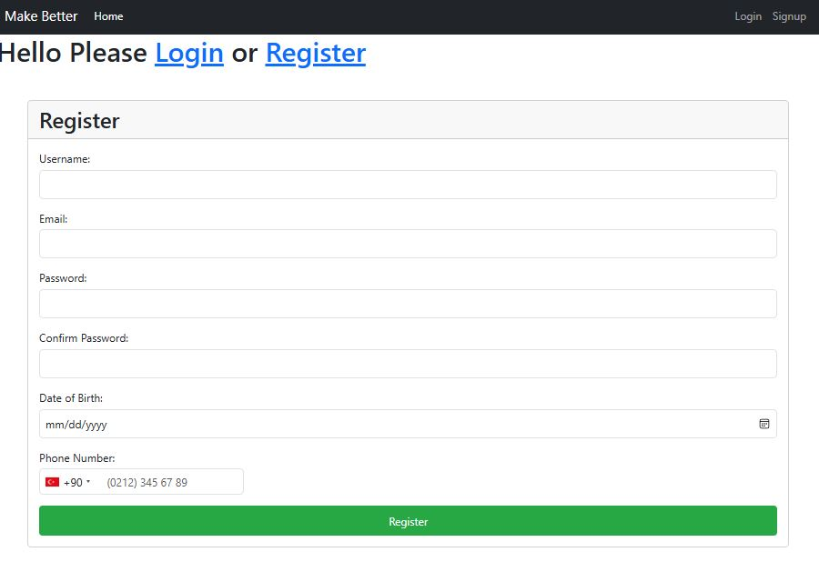

# Full-Stack Application

This repository contains a full-stack application built with a .NET backend and an Angular frontend.

## Table of Contents

- [Project Overview](#project-overview)
- [Technologies Used](#technologies-used)
- [Getting Started](#getting-started)
  - [Backend Setup (.NET)](#backend-setup-net)
  - [Frontend Setup (Angular)](#frontend-setup-angular)
- [Configuration](#configuration)
- [Building the Project](#building-the-project)
- [Running the Application](#running-the-application)
- [Login and Registration](#login-and-registration)
  - [Login Page](#login-page)
  - [Registration Page](#registration-page)
- [License](#license)

## Project Overview

This project is a complete full-stack application that includes a .NET backend for handling API requests and an Angular frontend for the user interface. The application provides a simple user authentication system with login and registration features.

## Technologies Used

- **Backend:**
  - .NET 7.0
  - MongoDB (Database)
  - JWT (JSON Web Tokens)

- **Frontend:**
  - Angular
  - Bootstrap 5

## Getting Started

### Backend Setup (.NET)

1. **Clone the Repository:**

   ```bash
   git clone https://github.com/theprelior/angular-login.git
   cd angular-login/backend
   ```

2. **Restore Dependencies:**

   ```bash
   dotnet restore
   ```

3. **Configure the Application:**

   - Open the `appsettings.json` file located at `backend/bin/Release/appsettings.json`.
   - Update the `ConnectionString` and `DatabaseName` under the `MongoDB` section to match your MongoDB setup.
   - Update the `Jwt` settings to suit your environment.

   Example:
   ```json
   {
      "MongoDB": {
         "ConnectionString": "your-mongodb-connection-string",
         "DatabaseName": "your-database-name"
      },
      "Jwt": {
         "Key": "your-jwt-secret-key",
         "Issuer": "your-domain.com",
         "Audience": "your-domain.com"
      }
   }
   ```

4. **Publish the Application:**

   The backend has already been published. The published files are located in the `backend/bin/Release/net7.0` directory.

   To manually publish (if needed):

   ```bash
   dotnet publish -c Release -o ./publish
   ```

5. **Run the Backend:**

   Navigate to the publish directory and run the application:

   ```bash
   cd backend/bin/Release/net7.0
   dotnet YourApp.dll
   ```

   or execute `YourApp.exe`.

### Frontend Setup (Angular)

1. **Navigate to the Frontend Directory:**

   ```bash
   cd ../new-project
   ```

2. **Install Dependencies:**

   ```bash
   npm install
   ```

3. **Build the Application:**

   The frontend has already been built, and the build files are located in the `/new-project/dist` directory.

   To manually build (if needed):

   ```bash
   ng build --configuration production
   ```

4. **Deploy or Run Locally:**

   - Deploy the contents of the `dist/new-project` directory to your web server.
   - Or run the application locally using a web server like `http-server`:

   ```bash
   ng serve
   ```

## Configuration

- **Backend:**
  - Configuration is managed through the `appsettings.json` file.
  
- **Frontend:**
  - Update the `apiUrl` in the `environment.ts` file if the API URL changes.

## Building the Project

- **Backend:** Already built and published in `backend/bin/Release/net7.0`.
- **Frontend:** Already built in `./new-project/dist/`.

## Running the Application

To run the application:

1. Start the backend by navigating to `backend/bin/Release/net7.0` and running `dotnet YourApp.dll`.
2. Serve the frontend files from the `./new-project/dist/` directory using a web server.

## Login and Registration

### Login Page

The login page is a crucial component of the application where users can authenticate themselves. The login form collects the username and password, which are sent to the backend for verification. Upon successful authentication, a JWT token is issued, which is stored in the browser's local storage for subsequent API calls.

- **Features:**
  - Username and password input fields.
  - "Register if you don't have an account" link for new users.
  - Error handling for incorrect credentials.
  - JWT token storage in local storage.
  - Display of the logged-in user's username and initial in the navbar.

Here is an image of the login page:



Since the user logged in, navbar and home should seem like this.


### Registration Page

The registration page allows new users to create an account. The form collects the user's username, email, password, date of birth, and phone number. The phone number field uses a special script from the GitHub topic 'angular-phone-number-input' to ensure correct formatting. Once registered, the user can log in using their new credentials.

- **Features:**
  - Input fields for username, email, password, date of birth, and phone number.
  - Validation for each input field.
  - Integration with the backend for user creation.
  - Success message upon successful registration.

Here is an image of the registration page:



## License

This project is licensed under the MIT License. See the [LICENSE](LICENSE) file for details.
```

This `README.md` file explains step by step how to install, configure, and run the project on the user's system. It is also stated that the user should edit the backend `appsettings.json` file according to their MongoDB connection information.
